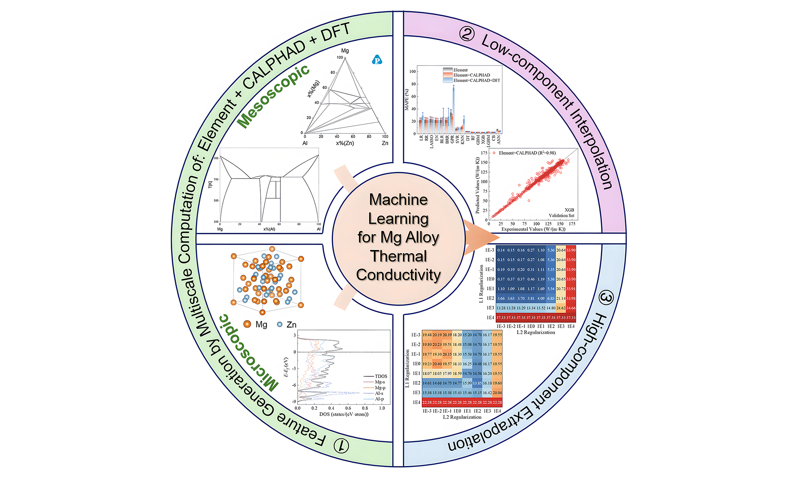

# Prediction of Thermal Conductivity in Multi-Component Magnesium Alloys

[](https://dx.doi.org/10.20517/jmi.2024.89) [](https://www.gnu.org/licenses/gpl-3.0)

This repository contains the official implementation of the paper: **"Prediction of thermal conductivity in multi-component magnesium alloys based on machine learning and multiscale computation"**.

## 📖 Introduction

Magnesium (Mg) alloys are gaining significant attention as next-generation lightweight, thermally conductive materials. However, their thermal conductivity tends to decrease significantly as the alloying content increases. This project introduces a novel approach that combines machine learning with multiscale computation to accurately and efficiently predict the thermal conductivity of multi-component Mg alloys.

We have systematically compiled a comprehensive database of 1,139 thermal conductivity measurements from as-cast Mg alloys. By constructing a multiscale feature set that includes elemental characteristics, thermodynamic properties, and electronic structure parameters, our model provides new insights and theoretical guidance to accelerate the development of high thermal conductivity Mg alloys.



---

## ✨ Key Features

*   **Innovative Predictive Model**: Utilizes the XGBoost algorithm combined with multiscale physical features for high-precision thermal conductivity prediction.
*   **Excellent Performance**:
    *   Achieves a Mean Absolute Percentage Error (MAPE) of just **2.16%** for ternary and simpler Mg alloy systems.
    *   Demonstrates strong generalization with a prediction error of **13.60%** for quaternary and higher-order novel systems, thanks to L1 and L2 regularization.
*   **Comprehensive Feature Engineering**: Identifies key predictive features—including atomic radius differences, enthalpy, cohesive energy, and the ratio of electronic thermal conductivity to relaxation time—using Sequential Forward Floating Selection (SFFS).
*   **Open-Source Core Components**:
    *   Core model implementation
    *   Feature engineering pipeline
    *   Sample dataset
    *   Evaluation scripts

---

## 🚀 Getting Started

### Prerequisites

Ensure you have Python 3.11+ and Conda installed.

### Installation

1.  **Clone the repository**
    ```bash
    git clone https://github.com/your-username/MgAlloy-ThermalCond-ML.git
    cd MgAlloy-ThermalCond-ML
    ```

2.  **Create and activate a Conda environment (Recommended)**
    ```bash
    conda create -n MGTCML_ENV python=3.11
    conda activate MGTCML_ENV
    ```

3.  **Install dependencies**
    ```bash
    # Ensure pip is up-to-date within the environment
    python -m pip install --upgrade pip

    pip install chardet jupyter notebook scikit-learn seaborn ipympl openpyxl tqdm

    # Create a directory for these custom packages
    mkdir packages && cd packages

    # Clone and install our fork of matminer for consistent feature calculation
    git clone -b main_for_yu https://github.com/Mat-Design-Yu/matminer_for_yu.git
    cd matminer_for_yu
    pip install -e .
    cd ..

    # Clone and install our fork of pymatgen, a dependency for matminer
    git clone -b master_for_yu https://github.com/Mat-Design-Yu/pymatgen_for_yu.git
    cd pymatgen_for_yu
    pip install -e .
    cd ..
    ```

## ✍️ How to Cite

If you use the code or ideas from this project in your research, please cite our paper.

**Plain Text (GB/T 7714):**
```
Chen J, Zhang Y, Luan J, et al. Prediction of thermal conductivity in multi-component magnesium alloys based on machine learning and multiscale computation[J]. Journal of Materials Informatics, 2025, 5: 22.
```

**BibTeX:**
```bibtex
@article{chen2025prediction,
  title={Prediction of thermal conductivity in multi-component magnesium alloys based on machine learning and multiscale computation},
  author={Chen, Junwei and Zhang, Yixin and Luan, Jiale and Fan, Yaxin and Yu, Zhigang and Liu, Baicheng and Chou, Kuochih},
  journal={Journal of Materials Informatics},
  volume={5},
  pages={22},
  year={2025},
  publisher={OAE Publishing Inc.},
  doi={10.20517/jmi.2024.89},
  url={https://dx.doi.org/10.20517/jmi.2024.89}
}
```

---

## 📜 License

This project is licensed under the [GPL-3.0 License](LICENSE).

---

## 📞 Contact

**Corresponding Author**: Prof. Zhigang Yu  
**Email**: `yuzg126@126.com`  

For questions or issues, please open an issue on GitHub.
